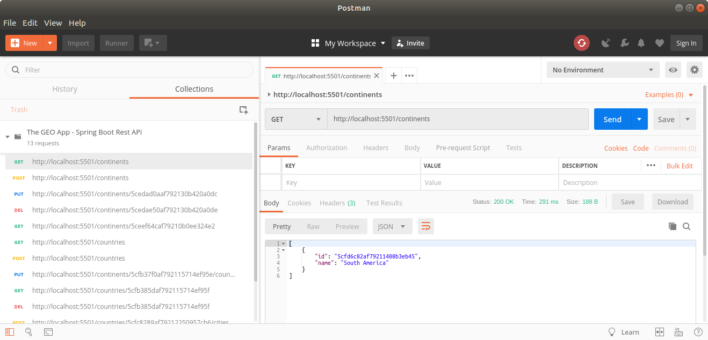

THE GEO REST API (SPRING BOOT)
------------------------------------------------------------------------------------------------------

REST API developed with Spring Boot, Maven and MongoDB.

This app contains a few services that deals with info about continents, countries and cities that are
used from an Angular app.

------------------------------------------------------------------------------------------------------

GET call to continents endpoint from Postman:

------------------------------------------------------------------------------------------------------

