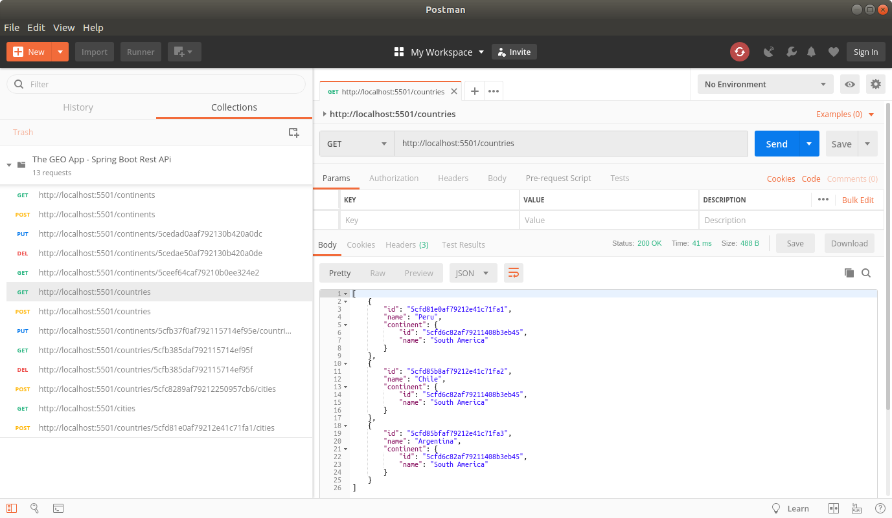
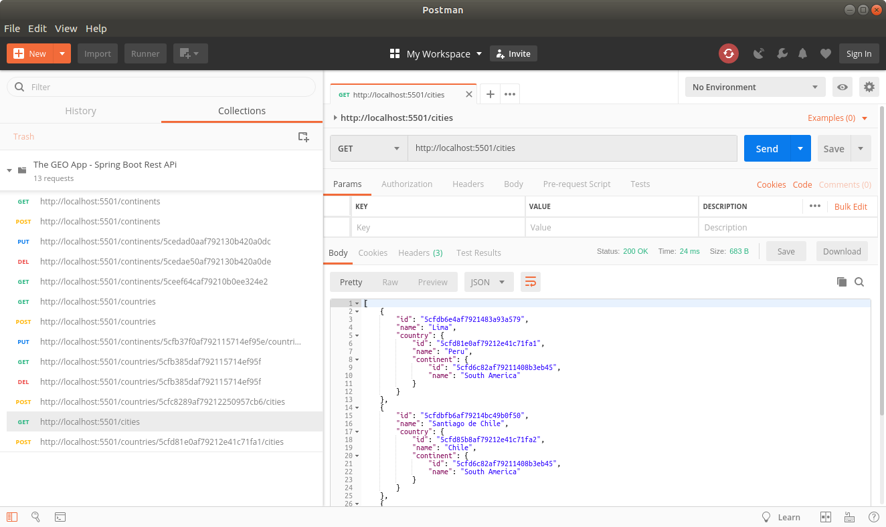

THE GEO REST API (SPRING BOOT)
------------------------------------------------------------------------------------------------------

Ejemplo de API REST desarrollada con Spring Boot, Maven y MongoDB.

La aplicación contiene los servicios rest necesarios para manipular información
de continentes, paises y ciudades que son utilizados por la aplicación SPA "THE GEO CLIENT".

------------------------------------------------------------------------------------------------------

Llamada GET a servicio rest de continentes desde Postman:

--------------------------------------------------------------------------------------------------------------------

Llamada GET a servicio rest de paises desde Postman:

--------------------------------------------------------------------------------------------------------------------

Llamada GET a servicio rest de ciudades desde Postman:

--------------------------------------------------------------------------------------------------------------------

Query de continentes desde consola de MongoDB:

--------------------------------------------------------------------------------------------------------------------

Github repository: https://github.com/edgar-code-repository/spring-boot-rest-geo-api

------------------------------------------------------------------------------------------------------
