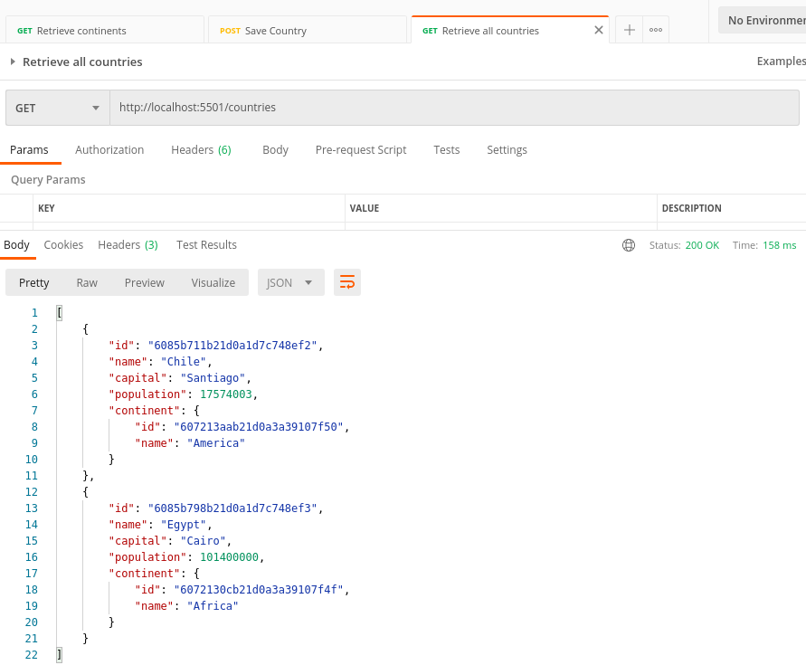

THE GEO REST API (SPRING BOOT)
------------------------------------------------------------------------------------------------------

Rest API developed with Spring Boot, Maven and MongoDB.

This app contains a few services that deal with info about continents, countries and cities that are
used from an Angular app.

------------------------------------------------------------------------------------------------------

Dependencies in POM file:

```

    <dependency>
        <groupId>org.springframework.boot</groupId>
        <artifactId>spring-boot-starter-web</artifactId>
    </dependency>

    <dependency>
        <groupId>org.springframework.boot</groupId>
        <artifactId>spring-boot-starter-data-mongodb</artifactId>
    </dependency>

    <dependency>
        <groupId>org.projectlombok</groupId>
        <artifactId>lombok</artifactId>
        <version>1.18.16</version>
        <scope>provided</scope>
    </dependency>

```

------------------------------------------------------------------------------------------------------

GET call to retrieve all continents:


------------------------------------------------------------------------------------------------------

GET call to retrieve all countries:



------------------------------------------------------------------------------------------------------

